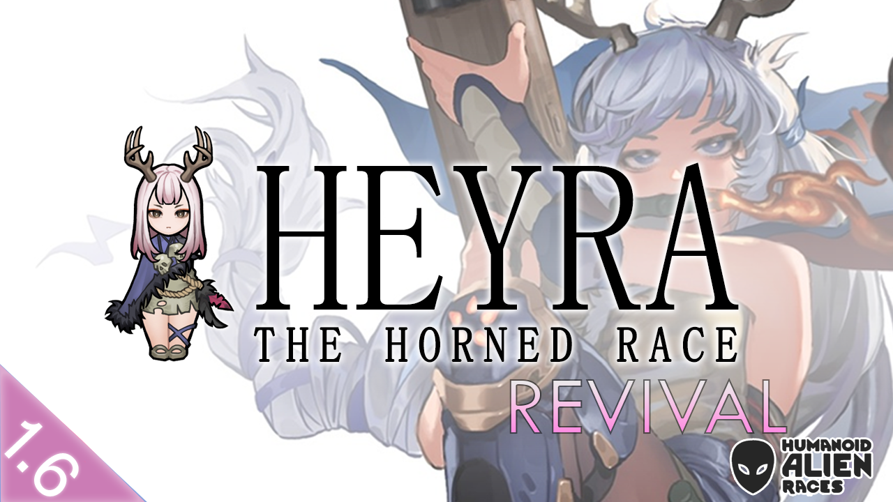

# Heyra the Horned — Revived



A community revival of **Bando's** beloved *Heyra the Horned* race mod, updated for **RimWorld 1.6** in the original author's absence.

**[→ Subscribe on Steam Workshop](https://steamcommunity.com/sharedfiles/filedetails/?id=3679943662)**

## About

This mod brings a new humanoid race to RimWorld. Heyras settled on the Rim a long time ago. They possess a unique psychic ability to, occasionally, hear whispers in their heads. Despite these whispers being mostly scattered words, Heyras believe they are the oracles of God. We do not know if these whispers are real — but it is confirmed that Heyras have a higher psychic sensitivity than humans.

Heyran factions are medieval level. However, with the help of your colony's technology, you may craft spacer-level Heyran gear for your Heyra colonists.

The mod also features the **Rong** people, the nemesis of the Heyras — a small group of fierce barbarians who make a living through constant raids.

## Features

- Heyra race with unique psychic abilities and a transformation system
- Rong rival faction with War-Automata
- Milksoy farming and bean processing chain
- Spacer-level Heyran equipment
- Ancestral Recall transformation mechanic
- Celestial Whisper ranged psychic ability

## Changes from the original

- Updated to RimWorld 1.6 compatibility
- MoHAR framework dependency removed (functionality internalized)
- VFE Core namespace updated for 1.6 (`VFECore.*` → `VEF.*`)
- Recompiled assemblies for Unity 2022.3.35

## Dependencies

| Mod | Link |
| --- | --- |
| Humanoid Alien Races (HAR) | [Workshop](https://steamcommunity.com/sharedfiles/filedetails/?id=839005762) |
| Vanilla Expanded Framework (VEF, includes MVCF + KCSG) | [Workshop](https://steamcommunity.com/sharedfiles/filedetails/?id=2023507013) |
| Ancot Library (biohorn visual rendering) | [Workshop](https://steamcommunity.com/workshop/filedetails/?id=2988801276) |

Load order: Harmony → HAR → VEF → Ancot Library → Heyra the Horned. Loads before Combat Extended if present.

## Installation

- **Steam:** subscribe on the [Workshop page](https://steamcommunity.com/sharedfiles/filedetails/?id=3679943662).
- **Manual:** download this repository and place the folder in your RimWorld `Mods/` directory. The compiled assembly is included — no build step needed.

## Building from source

The C# source lives in [`Source/`](Source/). RimWorld only loads the folders listed in `LoadFolders.xml` (`1.6/` and `Content/`), so the source folder ships harmlessly alongside the mod.

1. Open `Source/Heyra.csproj` and update `RimWorldDir` / `WorkshopDir` to your local paths (see the comments in the file).
2. Build:

   ```
   dotnet build Source/Heyra.csproj --configuration Release
   ```

The built `Heyra.dll` is copied into `1.6/Assemblies/` automatically after every build.

## Repository layout

```
About/            Mod metadata + Workshop preview
1.6/              Version-targeted Defs, Patches, and Assemblies
Content/          Textures and Sounds (version-independent)
WeaponTweakData/  Combat Extended weapon tweak data
Source/           C# source (Harmony patches, race systems, abilities)
LoadFolders.xml   Tells RimWorld what to load (1.6 + Content)
PatchNotes.md     Full changelog
```

## Credits

- **Bando** — original mod author. All creative work, art, and design.
- **Foxed** — 1.6 revival, code updates, and MoHAR internalization.
- **Gouda quiche** — MoHAR framework (open source, internalized with credit).

All rights to the original creative work belong to Bando. This revival is published in good faith due to the original author's extended absence. If Bando returns and requests removal, this mod (and this repository) will be taken down immediately.
